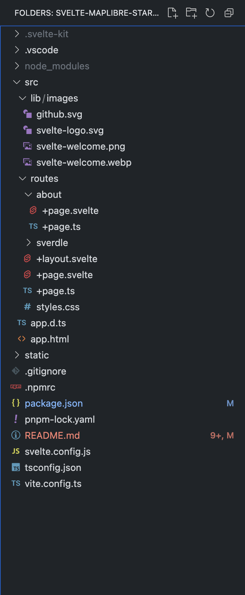

# svelte-maplibre-starter


<br>


<br>

Start MapLibre GL JS and Svelte easily.

- Svelte Maplibre v0.8.4
- Svelte v4.2.7
- SvelteKit v2.0.0
- node v19.0.0
- pnpm v8.15.1

# Usage



<br>

Install package

```bash
pnpm install
```

<br>

<br>

code format

```bash
pnpm run format
```

<br>

build

```bash
pnpm run build
```

<br>

dev

```bash
pnpm run dev
```

<br>

Unit Tests

```sh
pnpm run test:unit
```

<br>

Lint

```sh
pnpm run lint
```

<br>
<br>


<br>

# References

- [Svelte MapLibre](https://github.com/dimfeld/svelte-maplibre)
- [maplibregljs-svelte-starter](https://github.com/mug-jp/maplibregljs-svelte-starter?tab=readme-ov-file)

# Credits

- Svelte Logo created by [Svelte logo](https://github.com/sveltejs/branding)
- Svelte Maplibre Logo created by [Bruce Wayyn](https://github.com/brucewayyn)
